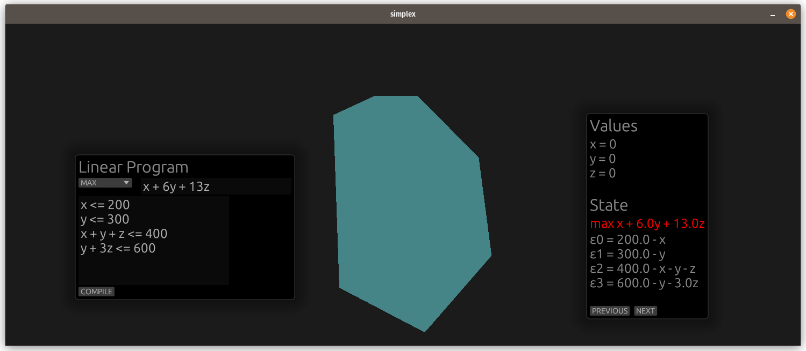

# Simplex

Provides an intuitive interface to enter linear programs, and
visualize their geometrical representation (a polyhedron) as well
as the intermediate states of the simplex algorithm.

## Usage

The app can run locally using `cargo run --release`, or [on the web
using WASM](https://aloisrautureau.github.io/simplex/).

The user can then input a linear program, choose wether they want
to maximize or minimize it, then run it using the "COMPILE" button.
Steps of the algorithm can be iterated through using the "PREVIOUS" and "NEXT"
buttons afterwards.

## How does it work?

### Algorithm
The visualization implements a simple version of the simplex algorithm,
revolving around a "LinearFunction" structure. This function overloads
all of the necessary operators, making the algorithm's implementation straightforward
and easy to understand.

### Visualization
Drawing the polyhedron is the most difficult part of the implementation.
We need to find all of the accessible points, then compute a convex hull from those.

This is done by thinking of the simplex algorithm as a graph. Each step is an edge
between two different states of the linear program, and therefore two different points.
Using this knowledge, we then perform a BFS to find all of the accessible points.

Finding a convex hull to render is even more complex, since rendering a 3D polyhedron correctly
requires that the vertices of each triangle are ordered properly (face culling),
and normals need to be computed for each vertex. Our current implementation simply renders
the triangles without lightning. We're working on adding diffuse lighting, but the
vertex ordering seems a bit tricky (using a more complex algorithm like quickhull might
solve this, but implementing it was outside of the scope of the project).

## What we wish to implement next

- Implementation using matrices, to be even closer to the mathematical definition
- QuickHull to find a convex hull of the polyhedron before drawing it
- Computation of the dual problem from a given linear program (matrix implementation makes this easy)